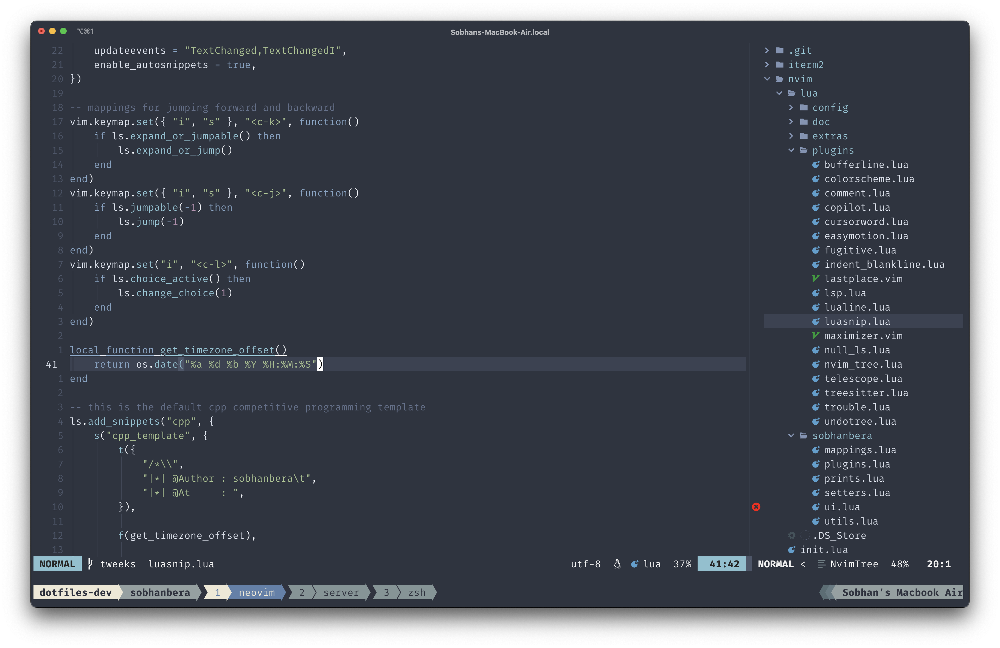
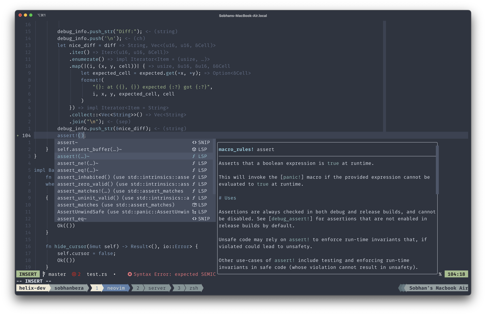
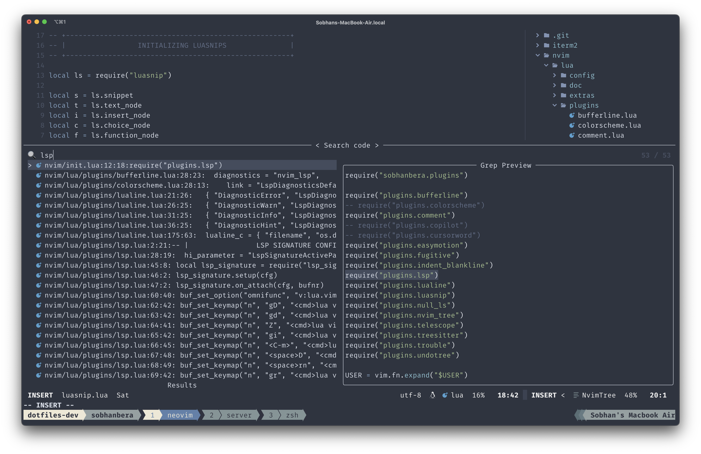
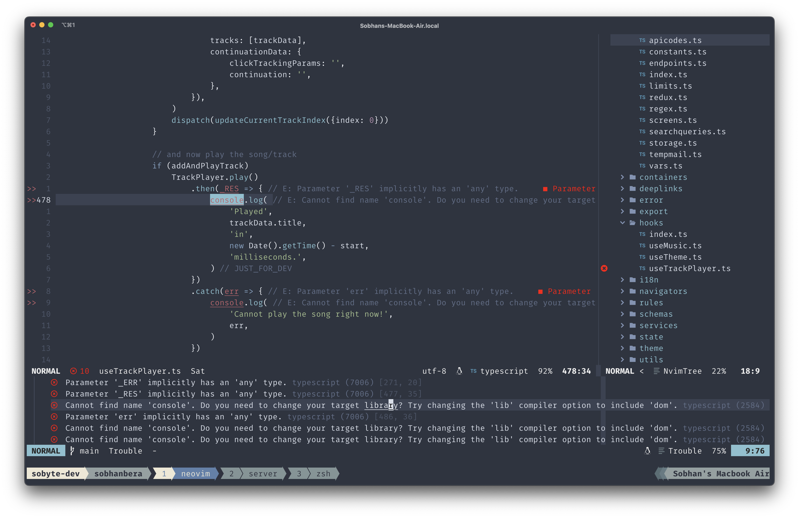

# Neovim Configurations





# About
I am a Full-Stack web/android developer. Currently also starting to work with rust. This repository primarily contains all my years of Neovim configurations.

# Features
- Full fledged plugins for development purpose.
- Treesitter integration.
- LSP working super fine.

# Use this plugins now
1. Install packer.nvim from [here](https://github.com/wbthomason/packer.nvim).
2. Create a folder in your root directory.
```
mkdir ~/.config/nvim
```
3. Clone this repository dire
```
git clone https://github.com/sobhanbera/dotfiles ~/.config/nvim
```
3. Launch Neovim. Follow packer.nvim instructions to install the plugins.
4. Hurray! That's it all the steps are completed and you now have a full fledged development workspace with you.

